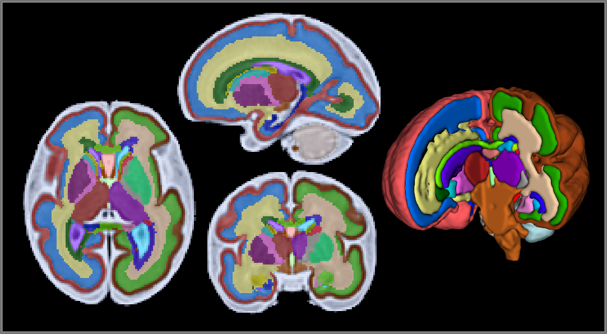

# CRL-2025-MAS

## Multi-atlas segmentation using the CRL2025 Atlas
This repository contains scripts and extra CRKIT tools used for a Fetal T2W reconstruction pipeline. By default, this pipeline uses the CRL2025 T2W Atlas[^CRL2025] as reference images to perform multi-atlas segmentation (MAS). 
ANTs[^ANTS] is used to perform non-rigid registrations of template to target images before segmentation. 
Segmentation[^STAPLE] is performed using Probabilistic GMM STAPLE available in the Computational Radiology Lab Toolkit, CRKIT.

## Pipeline script usage
* First rigidly register T2-weighted reconstructions to CRL atlas space with your registration tool of choice.

Command:
`sh MAS-pipeline.sh [Imagelist] [OutputDir] [MaxThreads]` 
  - Image list is a path list of atlas-space T2-weighted reconstructions and their gestational ages (GA, rounded to whole number weeks), for example:
  > /workdir/CASE001_t2w.nii.gz 34  /workdir/CASE002_t2w.nii.gz 22 /workdir/CASE003_t2w.nii.gz 29 /workdir/CASE004_t2w.nii.gz 36
  - Default settings will generate both tissue and regional segmentations
  - Runs partial volume correction (PVC) on the *tissue segmentation* (--noPVC argument to disable) 

 Output directory organization:
 > OutputDir/CASE001_t2w  
   template_rT: Temp files; non-rigid registrations of atlas images to the target image (and warped segmentations) 
   log: Records the command and input files for each segmentation 
   seg: Output segmentations 
   calc: If available, crosses tissue and regional segmentation to attempt a parcellated tissue segmentation 

## Modifying atlas images
You can swap or add atlas images to the atlas directory specified at the top of `MAS-pipeline.sh`, just make sure the filename of each file ends in `_atlas.nii.gz`. 
The script matches each `_atlas` file with corresponding segmentations, by default these are `tissue`, `tissueWMZ` and `regional`. 
Specify a custom label scheme like `-l YourLabelSuffix` 
You can change the output naming of the segmentation files with `-p YourOutputPrefix`

## CRL Toolkit (CRKit) Download
You can download CRKit, including STAPLE and other image maniuplation binaries utilized in these scripts, from NITRC:
https://www.nitrc.org/projects/staple

There's also a Docker container available with CRKit installed:
https://github.com/sergeicu/crkit-docker
Mileage may vary; this container may need to be modified for all relevant binaries to compile properly

## License/Data Use Agreement
These files are published under CC0 1.0 (public domain): https://creativecommons.org/publicdomain/zero/1.0/ 

Files in or referenced in this repository were developed for research purposes and are not intended for medical or diagnostic use and have no warranty. The authors and distributors do not make any guarantees regarding the accuracy or usefulness of results generated from these tools or their derivatives, and are not liable for any damages resulting from their use. 

If you find these scripts and/or the CRL2025 atlas useful, please cite (publication pending)[^CRL2025] 
If you utilize Probabilistic GMM STAPLE, please cite CRKit and Akhondi-Asl et al[^STAPLE]. 
Please cite ANTs the ANTs toolkit is used for image registration[^ANTS]. 
3D rendering created using ITK-SNAP[^SNAP].

[^CRL2025]:https://doi.org/10.7910/DVN/QOO75G
[^ANTS]:Symmetric diffeomorphic image registration with cross-correlation: evaluating automated labeling of elderly and neurodegenerative brain. Med Image Anal (2008). https://github.com/ANTsX/ANTs
[^STAPLE]:Akhondi-Asl, A. and Warfield, S.K., 2013. Simultaneous truth and performance level estimation through fusion of probabilistic segmentations. IEEE transactions on medical imaging, 32(10), pp.1840-1852.
[^SNAP]:https://www.itksnap.org/pmwiki/pmwiki.php