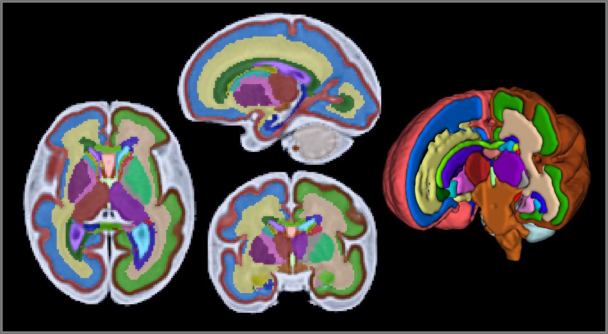

# CRL-2025-MAS



## Multi-atlas segmentation using the CRL2025 Atlas
This repository contains scripts and extra CRKIT tools used for fetal T2W reconstructed image segmentation. By default, this pipeline uses the CRL2025 T2W Atlas[^CRL2025] as reference images to perform multi-atlas segmentation (MAS).<br>
ANTs[^ANTS] is used to perform non-rigid registrations of template to target images before segmentation.<br>
Segmentation[^STAPLE] is performed using Probabilistic GMM STAPLE available in the Computational Radiology Lab Toolkit, CRKIT.


### Dependencies
Either:
* CRKIT: https://www.nitrc.org/projects/staple
* ANTs[^ANTS] 
* Apptainer (CRKit and ANTs not needed if using container mode)

### Pipeline script usage
* For better results, input T2 reconstructions should first be rigidly registered to CRL atlas space
* Configure `config.sh` to point to the directory with your template or reference images (CRLMASREF environment variable)
* Verify tlist.txt lists your template files relative to CRLMASREF

Command:
```
Usage: sh ${0} [-h] [-a AtlasList.txt -l AtlasLabelsPrefix] [-p OutputSegPrefix] [-k] -- [Imagelist] [OutputDir] [MaxThreads]

    -h      display this help and exit
    -a      supply a structual ATLAS text list, formatted like:
                PATH/t2w_GA30_atlas.nii.gz 30
                PATH/t2w_GA31_atlas.nii.gz 31 ... etc
    -l      [required if -a is specified] specify atlas label suffix. Label files need to be in the same directory as atlases and named like:
                PATH/t2w_GA30_SUFFIX.nii.gz
                PATH/t2w_GA31_SUFFIX.nii.gz ...etc
                (defualt: all three of tissue, tissueWMZ, and regional)
    -p      specify output segmentation prefix (default: mas)
    -k      Use crkit container for CRL and ANTs programs

    [Imagelist] A text file with a list of input images formatted with one image per row and GA, i.e.
                PATH/image01.nii.gz 32
                PATH/image02.nii.gz 29 ...etc
    [OutputDir] Output directory for all working files and output segmentations
    [MaxThreads] Maximum number of CPUs for running concurrent registrations and multi-threaded STAPLE (usually 8-12)
```
  - Image list is a path list of atlas-space T2-weighted reconstructions and their gestational ages (GA, rounded to whole number weeks), for example:
  > /workdir/CASE001_t2w.nii.gz 34 <br>/workdir/CASE002_t2w.nii.gz 22<br>/workdir/CASE003_t2w.nii.gz 29<br>/workdir/CASE004_t2w.nii.gz 36
  - Default settings will generate both tissue and regional segmentations
  - Runs partial volume correction (PVC) on the *tissue segmentation* (--noPVC argument to disable) 

  Note `-k` argument for Container Mode: uses Docker containers for CRL and ANTs tools whenever possible, using Apptainer/Singularity.

 Output directory organization:
 > OutputDir/CASE001_t2w <br>
   template_rT: Temp files; non-rigid registrations of atlas images to the target image (and warped segmentations)<br>
   log: Records the command and input files for each segmentation<br>
   seg: Output segmentations<br>
   calc: If available, crosses tissue and regional segmentation to attempt a parcellated tissue segmentation<br>

### Modifying atlas images
You can swap or add atlas images to the atlas directory specified in `config.sh`, just make sure the filename of each file ends in `_atlas.nii.gz`.<br>
The script matches each `_atlas` file with corresponding segmentations, by default these are named `tissue`, `tissueWMZ` and `regional`.<br>
Specify a custom label scheme like `-l YourLabelSuffix`<br>
You can change the output naming of the segmentation files with `-p YourOutputPrefix`

### CRL Toolkit (CRKit) Download
Download CRKit, including STAPLE and other image maniuplation binaries utilized in these scripts, from NITRC:
https://www.nitrc.org/projects/staple

There is a Docker container available with CRKit installed:
https://github.com/arfentul/crkit
Your mileage may vary; in its current state not all relevant binaries compile properly

### CRKIT installation notes
As of 2/26/26, crlProbabilisticGMMSTAPLE is not found in the CRKIT docker container build, requiring installation of CRKIT from the NITRC listing. Necessary libraries may also be missing. I was able to patch my local installation of CRKIT doing the following:
* Navigate to `crkit/bin/`
* `g++ -shared -o libITKNLOPTOptimizers.so libITKNLOPTOptimizers.a`
* `yum install nlopt`
* `ln -s /lib64/libnlopt_cxx.so.0 /lib64/libnlopt.so.0`
* `g++ -shared -o libcrlCommon.so libcrlCommon.a`

### License/Data Use Agreement
These files are published under CC BY 4.0: https://creativecommons.org/licenses/by/4.0/<br>

Files in or referenced in this repository were developed for research purposes and are not intended for medical or diagnostic use and have no warranty. The authors and distributors do not make any guarantees regarding the accuracy or usefulness of results generated from these tools or their derivatives, and are not liable for any damages resulting from their use.<br>

When making use of this work, based on the data use agreement you are required to cite the noted publication with its associated DOI link.[^CRL2025]<br>
If you utilize Probabilistic GMM STAPLE, please cite CRKit and Akhondi-Asl et al[^STAPLE].<br>
Please cite ANTs if the ANTs toolkit is used for image registration[^ANTS].<br>
3D rendering created using ITK-SNAP[^SNAP].

[^CRL2025]:Bagheri, M., Velasco-Annis, C., Wang, J., Faghihpirayesh, R., Khan, S., Calixto, C., Jaimes, C., Vasung, L., Ouaalam, A., Afacan, O., Warfield, S.K., Rollins, C.K., Gholipour, A., 2025. An MRI Atlas of the Human Fetal Brain: Reference and Segmentation Tools for Fetal Brain MRI Analysis. arXiv preprint arXiv:2508.15034. https://doi.org/10.7910/DVN/QOO75G
[^ANTS]:Avants, B.B., Epstein, C.L., Grossman, M. and Gee, J.C., Symmetric diffeomorphic image registration with cross-correlation: evaluating automated labeling of elderly and neurodegenerative brain. Med Image Anal (2008). https://github.com/ANTsX/ANTs
[^STAPLE]:Akhondi-Asl, A. and Warfield, S.K., 2013. Simultaneous truth and performance level estimation through fusion of probabilistic segmentations. IEEE transactions on medical imaging, 32(10), pp.1840-1852.
[^SNAP]:Yushkevich, P.A., Gao, Y. and Gerig, G., 2016, August. ITK-SNAP: An interactive tool for semi-automatic segmentation of multi-modality biomedical images. In 2016 38th annual international conference of the IEEE engineering in medicine and biology society (EMBC) (pp. 3342-3345). IEEE. https://www.itksnap.org/pmwiki/pmwiki.php
